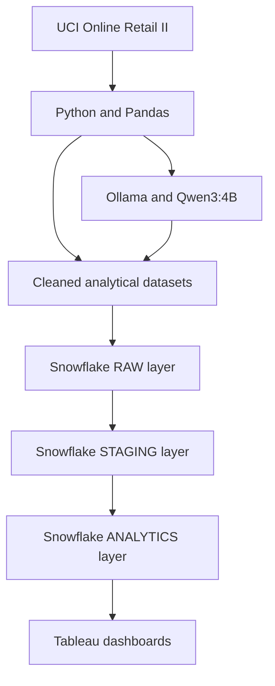
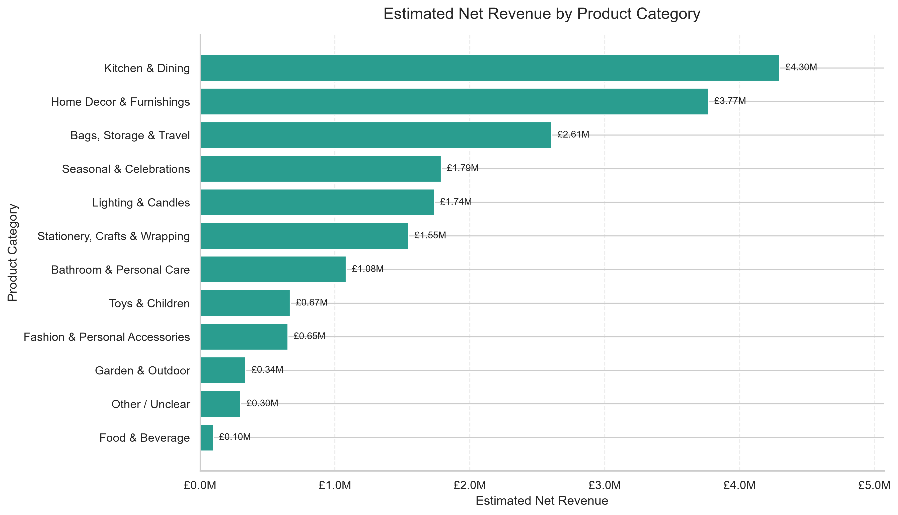
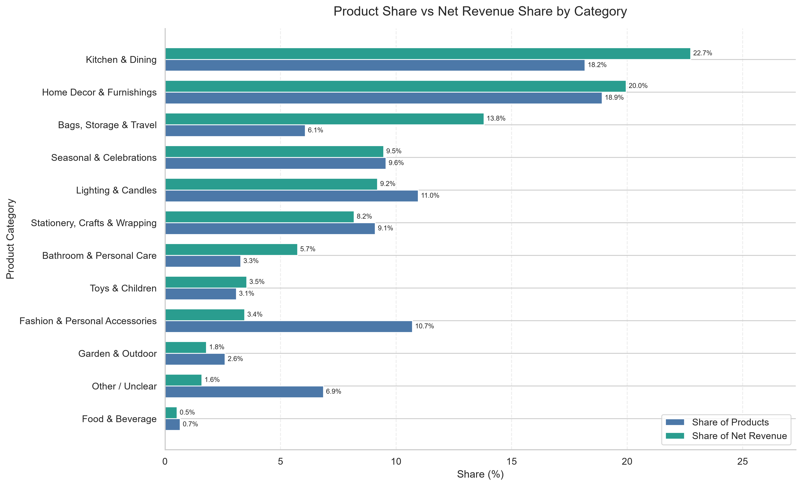
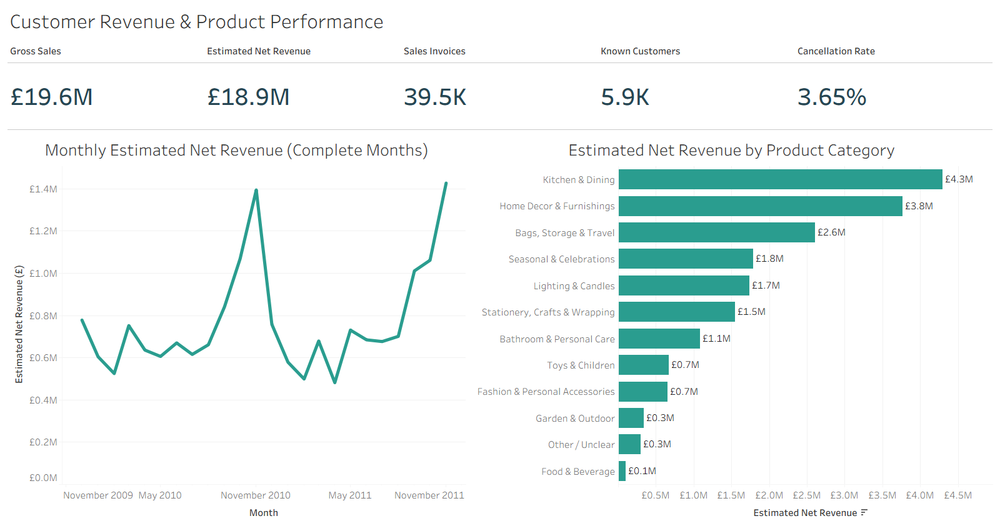
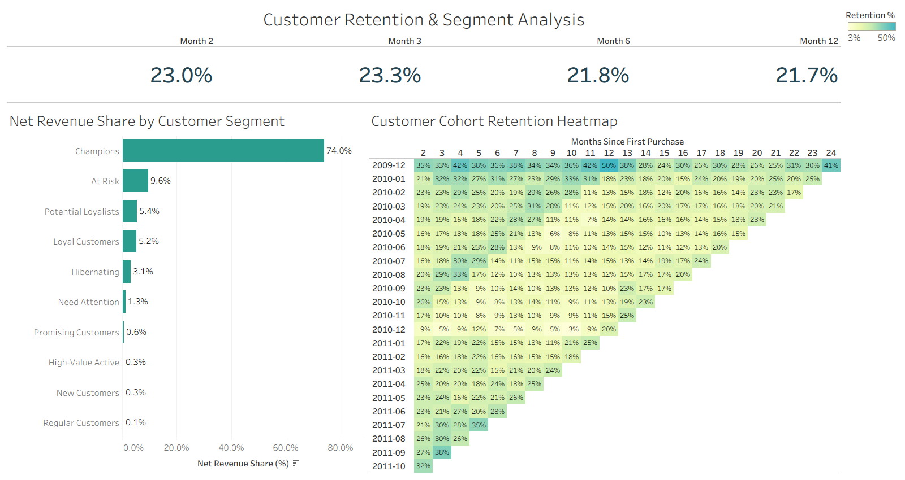

# Customer Revenue & Retention Analytics

An end-to-end retail analytics project using Python, Snowflake SQL, Tableau, and a locally hosted generative AI model to analyze revenue performance, customer behaviour, cohort retention, and product-category performance.

## Project Overview

This project analyzes **1,033,036 cleaned retail transactions** from a UK-based online retailer, covering December 2009 through December 2011.

The project combines:

* Python and Pandas for data preparation and exploratory analysis
* RFM analysis for customer segmentation
* Cohort analysis for measuring customer retention
* Ollama and Qwen3:4B for local product classification
* Snowflake for cloud data warehousing
* Tableau for interactive business dashboards

## Business Questions

The project addresses the following questions:

* How much gross and net merchandise revenue was generated?
* How much revenue was lost through cancellations?
* How did monthly revenue change over time?
* What proportion of customers made repeat purchases?
* Which customer segments contributed the most revenue?
* How did customer retention change after the first purchase?
* Which product categories generated the most net revenue?

## Project Architecture



## Tools and Technologies

* Python
* Pandas and NumPy
* Matplotlib and Seaborn
* Jupyter Notebook
* Snowflake SQL
* Tableau
* Ollama
* Qwen3:4B
* Git and GitHub
* Visual Studio Code

## Key Business Results

| KPI                     |         Result |
| ----------------------- | -------------: |
| Gross merchandise sales | £19,604,891.64 |
| Estimated net revenue   | £18,888,429.07 |
| Cancellation value      |    £716,462.57 |
| Cancellation rate       |          3.65% |
| Sales invoices          |         39,515 |
| Units sold              |     11,188,001 |
| Known customers         |          5,852 |
| Average order value     |        £496.14 |

## Customer Insights

* Repeat customers represented **72.35%** of known customers.
* Repeat customers generated **96.74%** of identified-customer gross sales.
* One-time customers represented **27.65%** of known customers.
* The **Champions** segment contained **1,448 customers**.
* Champions represented **24.74%** of identified customers.
* Champions generated **74.04%** of identified-customer net revenue.

## Customer Retention

| Retention period | Weighted retention |
| ---------------- | -----------------: |
| Month 2          |             23.04% |
| Month 3          |             23.29% |
| Month 6          |             21.75% |
| Month 12         |             21.65% |

The cohort heatmap shows a substantial decline after the initial purchase. Retention then remains comparatively stable at approximately 20% across many mature cohorts.

Weighted retention was calculated using the total retained customers and total eligible customers across all eligible cohorts for each retention period.

## Generative AI Product Classification

Product descriptions were classified into business-friendly categories using the local **Qwen3:4B** model through Ollama.

The classification workflow included:

* Local LLM-based classification
* A controlled business-category taxonomy
* Keyword-rule validation
* Model and rule agreement checks
* High-confidence rule overrides
* Manual quality assurance
* Structural and completeness validation

The final classification output contains:

* **4,725 product records**
* **4,725 unique stock codes**
* **12 finalized product categories**
* **0 duplicate stock codes**
* **0 missing classification categories**

The category-performance mart also preserves a transparent `Unclassified` bucket for unmatched technical or non-sale stock codes that were outside the finalized product-classification input.

Because the model runs locally, the workflow does not require a paid API and does not send transaction data to an external AI service.

### GenAI Category Analysis

#### Net Revenue by Product Category



#### Product Share vs Revenue Share



## Tableau Dashboards

### Revenue Overview

The Revenue Overview dashboard presents:

* Gross merchandise sales
* Estimated net revenue
* Sales invoice count
* Known customer count
* Cancellation rate
* Complete-month estimated net revenue trend
* Estimated net revenue by product category



### Retention Overview

The Retention Overview dashboard presents:

* Weighted retention KPIs for Months 2, 3, 6, and 12
* Net-revenue contribution by customer segment
* Customer cohort retention heatmap
* Retention percentage colour scale



The Tableau workbook is available here:

[Download the Tableau workbook](tableau/Customer_Revenue_Retention_Analytics_Snowflake.twbx)

## Project Workflow

1. Inspect and combine the original transaction worksheets.
2. Standardize column names and data types.
3. Remove duplicates and identify invalid records.
4. Separate merchandise sales, cancellations, and non-merchandise records.
5. Calculate gross sales, cancellation value, and estimated net revenue.
6. Create customer-level and RFM segment analysis.
7. Build monthly cohort-retention matrices.
8. Classify product descriptions with a local generative AI model.
9. Load the cleaned analytical outputs into Snowflake.
10. Build RAW, STAGING, and ANALYTICS warehouse layers.
11. Validate warehouse totals and business KPIs.
12. Connect Tableau to the Snowflake presentation views.
13. Build and validate the final dashboards.

## Repository Structure

```text
Customer-Revenue-Retention-Analytics/
│
├── data/
│   ├── README.md
│   └── processed/
│       ├── analytics/
│       └── cleaning_validation_summary.csv
│
├── documentation/
│   ├── Data_Dictionary.md
│   └── Methodology.md
│
├── notebooks/
│   ├── 01_data_inspection.ipynb
│   ├── 02_data_cleaning.ipynb
│   ├── 03_revenue_analysis.ipynb
│   ├── 04_customer_segmentation.ipynb
│   ├── 05_retention_cohort_analysis.ipynb
│   └── 06_genai_product_classification.ipynb
│
├── screenshots/
│   ├── tableau_revenue_overview.png
│   ├── tableau_retention_overview.png
│   ├── genai_category_net_revenue.png
│   └── genai_product_vs_revenue_share.png
│
├── sql/
│   ├── 01_environment_setup.sql
│   ├── 02_raw_table_setup.sql
│   ├── 03_raw_data_validation.sql
│   ├── 04_staging_model.sql
│   ├── 05_revenue_marts.sql
│   ├── 06_customer_marts.sql
│   ├── 07_retention_marts.sql
│   ├── 08_customer_segment_mart.sql
│   ├── 09_product_category_mart.sql
│   ├── 10_final_snowflake_validation.sql
│   └── 11_tableau_presentation_views.sql
│
├── tableau/
│   ├── Customer_Revenue_Retention_Analytics_Snowflake.twbx
│   └── README.md
│
├── .gitignore
├── README.md
└── requirements.txt
```

## Snowflake Data Model

The Snowflake implementation uses three layers:

* **RAW:** Stores the cleaned transaction-level data loaded into Snowflake.
* **STAGING:** Standardizes dates, business flags, transaction types, and revenue measures.
* **ANALYTICS:** Contains customer, revenue, retention, segmentation, product-category, and Tableau presentation views.

The final warehouse validation confirmed:

* RAW and STAGING row counts match at **1,033,036**
* All **10 required core analytical views** exist
* Revenue totals reconcile across warehouse layers
* RFM customer totals reconcile to **5,852 customers**
* Product classification records contain no duplicate stock codes
* Product-category revenue shares total **100%**

## Dataset

This project uses the **Online Retail II** dataset from the UCI Machine Learning Repository.

The original dataset contains **1,067,371 transaction records** from a UK-based online retailer.

The original Excel file is not included in this repository because of its size. It can be downloaded from:

[UCI Online Retail II Dataset](https://archive.ics.uci.edu/dataset/502/online%2Bretail%2Bii)

Place the downloaded file at:

```text
data/raw/online_retail_II.xlsx
```

## Running the Project

### 1. Clone the repository

```bash
git clone https://github.com/beingbrute/Customer-Revenue-Retention-Analytics.git
cd Customer-Revenue-Retention-Analytics
```


### 2. Install the Python packages

```bash
pip install -r requirements.txt
```

### 3. Install the local AI model

Install Ollama and download Qwen3:4B:

```bash
ollama pull qwen3:4b
```

### 4. Run the Python notebooks

Run the notebooks sequentially from `01` through `06`.

### 5. Build the Snowflake warehouse

Run the numbered SQL files in the `sql` folder in sequence.

After running the raw-table setup, load the cleaned transaction output and the generated customer-segment and product-classification outputs into their corresponding Snowflake tables.

### 6. Open the Tableau workbook

Open:

```text
tableau/Customer_Revenue_Retention_Analytics_Snowflake.twbx
```

Sign in to Snowflake if Tableau requests a connection.

## Documentation

Additional documentation is available in:

* [Methodology](documentation/Methodology.md)
* [Data Dictionary](documentation/Data_Dictionary.md)
* [Tableau Documentation](tableau/README.md)

## Author

**Aditya Ranjan**

Aspiring Data Analyst skilled in Python, SQL, Snowflake, Tableau, Power BI, Excel, data cleaning, ETL, and data visualization.
